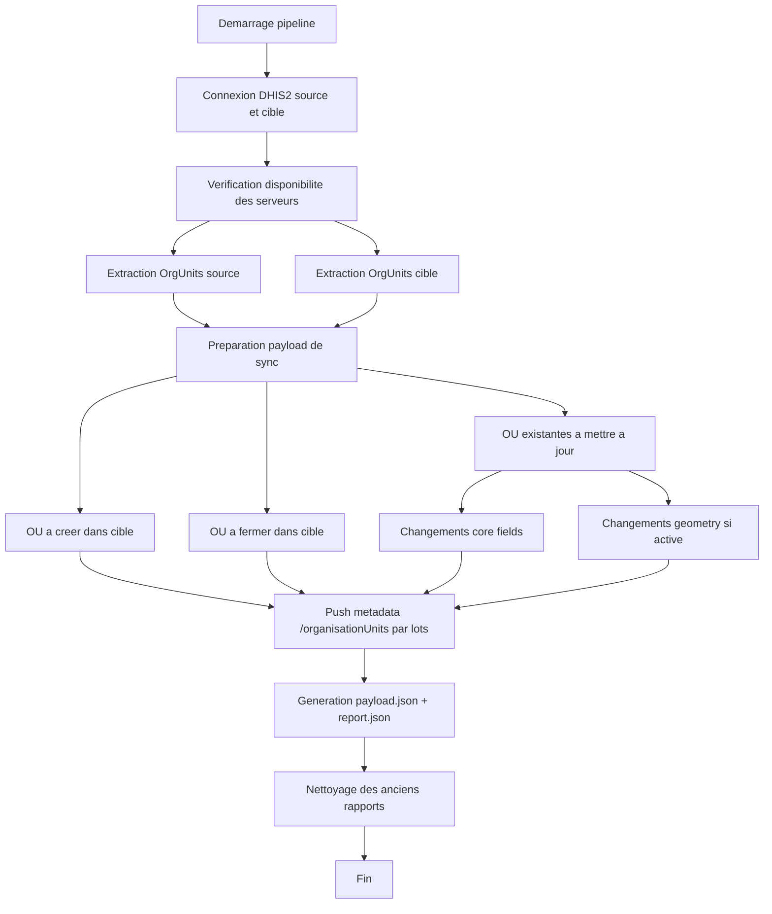

# SNIS -> DEDOP Sync OrgUnits

Pipeline OpenHEXA pour synchroniser les **unites d'organisation (Organisation Units)** entre deux instances DHIS2:
- source: SNIS
- cible: DEDOP

Le pipeline gere:
- creation des OU absentes dans la cible
- fermeture des OU absentes dans la source
- mise a jour des OU existantes quand des champs changent (`name`, `shortName`, `code`, `parent`, `openingDate`, `closedDate`)
- mise a jour optionnelle des geometries (`geometry`, ou fallback `featureType`/`coordinates`)

## Nouveautes

- Synchronisation des OU existantes sur changements de champs metier:
  `name`, `shortName`, `code`, `parent.id`, `openingDate`, `closedDate`.
- Nouveau parametre `sync_existing_geometries` (defaut `true`) pour activer/desactiver
  la mise a jour des geometries des OU deja presentes dans la cible.

## Objectif

Faciliter la reutilisation du pipeline avec d'autres projets DHIS2/OpenHEXA en gardant:
- une logique claire de comparaison source/cible
- des parametres explicites
- un rapport d'import exploitable

## Flowchart

## Structure

- `pipeline.py`: logique complete du pipeline
- `requirements.txt`: dependances Python
- `workspace.yaml`: configuration locale de workspace
- `workspace/`: repertoire de sorties locales

## Prerequis

- Python 3.11+
- OpenHEXA CLI (si deployment via CI/CD ou push manuel)
- Deux connexions DHIS2 configurees dans OpenHEXA:
  - SNIS (source)
  - DEDOP (cible)

Dependance principale:
- `openhexa-toolbox~=2.9`

## Parametres du pipeline

- `snis_connection` (obligatoire): connexion DHIS2 source
- `dedop_connection` (obligatoire): connexion DHIS2 cible
- `output_directory` (obligatoire): chemin racine des rapports
- `sync_existing_geometries` (optionnel, defaut `true`): met a jour les geometries des OU deja existantes
  - `true`: met a jour les changements de geometrie
  - `false`: ignore les changements de geometrie, conserve seulement les updates des champs metier
- `dry_run` (optionnel, defaut `false`): simulation sans ecriture
- `import_mode` (optionnel, defaut `CREATE_AND_UPDATE`): strategie DHIS2
- `post_batch_size` (optionnel, defaut `5000`): taille des lots POST

## Regles de synchronisation

Comparaison par `id` d'Organisation Unit:
- present dans SNIS et absent dans DEDOP -> creation
- absent dans SNIS et present dans DEDOP -> fermeture (`closedDate`)
- present dans les deux -> update si differences detectees

Champs surveilles pour update des OU existantes:
- `name`, `shortName`, `code`, `parent.id`, `openingDate`, `closedDate`
- et `geometry` (uniquement si `sync_existing_geometries=true`)

## Sorties

Pour chaque execution avec payload non vide:
- `payload.json`: donnees envoyees
- `report.json`: resume d'import DHIS2

Chemin de sortie:
- `<workspace.files_path>/<output_directory>/orgUnits/<timestamp>/`
